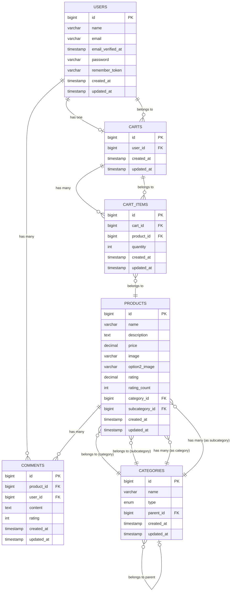

# Bigyonomicon Webáruház Dokumentáció

## Tartalomjegyzék
- [Bevezetés](#bevezetés)
  - [Fejlesztői csapat](#fejlesztői-csapat)
- [Funkciók áttekintése](#funkciók-áttekintése)
  - [Webáruház funkciók](#webáruház-funkciók)
  - [Offline mód - Flappy Bird játék](#offline-mód---flappy-bird-játék)
  - [WPF Admin Alkalmazás](#wpf-admin-alkalmazás)
- [Rendszerkövetelmények](#rendszerkövetelmények)
- [Telepítés](#telepítés)
- [Frontend dokumentáció](#frontend-dokumentáció)
  - [Technológiák](#technológiák)
  - [Felhasználói felület](#felhasználói-felület)
  - [Reszponzív design](#reszponzív-design)
  - [Komponensek](#komponensek)
  - [Stílusok és témák](#stílusok-és-témák)
- [Backend dokumentáció](#backend-dokumentáció)
  - [Architektúra](#architektúra)
  - [API végpontok](#api-végpontok)
  - [Modellek](#modellek)
  - [Kontrollerek](#kontrollerek)
- [Adatbázis struktúra](#adatbázis-struktúra)
  - [Táblák](#táblák)
  - [Kapcsolatok](#kapcsolatok)
  - [Adatbázis diagram](#adatbázis-diagram)
- [Tesztelés](#tesztelés)
- [Hibaelhárítás](#hibaelhárítás)
- [Adatbázis mentés (dump)](#adatbázis-mentés-dump)
  - [A dump fájl](#a-dump-fájl)
  - [A dump fájl tartalma](#a-dump-fájl-tartalma)
  - [A dump fájl használata](#a-dump-fájl-használata)
  - [A dump fájl előnyei](#a-dump-fájl-előnyei)
- [Összefoglalás](#összefoglalás)
- [További információk](#további-információk)

## Bevezetés

A Bigyonomicon egy modern, Laravel-alapú webáruház, amely számos fejlett funkcióval rendelkezik. Ez a dokumentáció részletesen bemutatja a rendszer működését, architektúráját, adatbázis struktúráját és funkcióit.

### Fejlesztői csapat

A Bigyonomicon webáruház fejlesztésében a következő személyek vettek részt:

- **Barta Márk**: Adatbázis struktúra és backend fejlesztés
- **Simon Soma Benedek**: Flappy Bird játék fejlesztése (offline mód)
- **Badari-Békési Alex**: Frontend, design és 3D képek megvalósítása

## Funkciók áttekintése

### Webáruház funkciók

#### Termékkezelés
- **Termékek megjelenítése**: A termékek kategóriákba rendezve jelennek meg, képekkel, árakkal és értékelésekkel.
- **Termékszűrés**: A termékek szűrhetők ár (10,000-990,000 Ft) és értékelés (1-10) alapján csúszkák segítségével.
- **Részletes termékoldal**: Minden termékhez részletes leírás, képek és vásárlói értékelések tartoznak.
- **Keresés**: Részleges szövegkeresés a termékek között.

#### Felhasználói funkciók
- **Regisztráció és bejelentkezés**: Felhasználói fiók létrehozása és bejelentkezés.
- **Jelszó validáció**: Minimum 8 karakter, betűk és számok kombinációja.
- **Kosár kezelése**: Termékek hozzáadása a kosárhoz, mennyiség módosítása.
- **Értékelések és kommentek**: Felhasználók értékelhetik a termékeket (1-10 csillag) és kommenteket írhatnak.

#### Fizetési rendszer
- **Kosár megtekintése**: A "Kosár" vagy "A Kosárhoz" gombra kattintva megtekinthetők a kosárba helyezett termékek.
- **Fizetési folyamat**: Bankkártya adatok megadása (tesztadatok is használhatók).
- **Sikeres fizetés**: A fizetés után "A fizetés sikeres volt..." üzenet jelenik meg.

### Offline mód - Flappy Bird játék

A webáruház egyik különleges funkciója az offline mód kezelése:

- **Internetkapcsolat ellenőrzése**: Az oldal betöltésekor a rendszer ellenőrzi az internetkapcsolatot.
- **Offline mód aktiválása**: Internetkapcsolat hiányában automatikusan megnyílik a Flappy Bird játék.
- **"No Internet Connection" gomb**: A "Kosár" mellett található gomb, amelyre kattintva bármikor elindítható a játék.
- **Játékmenet**: A klasszikus Flappy Bird játék, ahol a madarat irányítva kell áthaladni az akadályok között.

### WPF Admin Alkalmazás

A webáruház adatbázisának kezeléséhez egy különálló WPF asztali alkalmazás is tartozik:

- **Termékkezelés**: Termékek hozzáadása, szerkesztése, törlése.
- **Kategóriakezelés**: Kategóriák és alkategóriák kezelése.
- **API integráció**: Az alkalmazás a webáruház API-ján keresztül kommunikál az adatbázissal.

## Rendszerkövetelmények

- PHP 8.1 vagy újabb
- Composer
- MySQL 5.7 vagy újabb
- Node.js és NPM
- .NET 6.0 (WPF alkalmazáshoz)

## Telepítés

```bash
# Projekt klónozása
git clone https://github.com/your-username/bigyonomicon.git
cd bigyonomicon

# Függőségek telepítése
composer install
npm install

# Környezeti változók beállítása
cp .env.example .env
php artisan key:generate

# Adatbázis migrációk és seeder futtatása
php artisan migrate --seed

# Frontend assets fordítása
npm run dev

# Szerver indítása
php artisan serve
```

## Frontend dokumentáció

A Bigyonomicon webáruház frontend része modern, felhasználóbarát felületet biztosít, amely lehetővé teszi a felhasználók számára a termékek böngészését, szűrését, kosárba helyezését és a vásárlási folyamat végrehajtását.

### Technológiák

A frontend fejlesztéséhez a következő technológiákat használtuk:

- **HTML5**: A weboldal struktúrájának kialakításához
- **CSS3**: A stílusok és animációk megvalósításához
- **JavaScript**: A dinamikus funkciók és interakciók kezeléséhez
- **Bootstrap 5**: A reszponzív design és komponensek alapjául
- **jQuery**: A DOM manipulációk és AJAX kérések egyszerűsítéséhez
- **Vite**: A frontend eszközök és erőforrások kezeléséhez
- **Blade**: A Laravel template rendszere a dinamikus tartalom megjelenítéséhez

### Felhasználói felület

A webáruház felhasználói felülete a következő fő részekből áll:

#### Fejléc (Header)

- **Logó**: A webáruház logója, amely a főoldalra navigál
- **Navigációs menü**: Főlap, Áruház, Kapcsolat, Kosár menüpontok
- **"No Internet Connection" gomb**: Az offline mód aktiválásához

#### Főoldal

- **Kiemelt termékek**: A legnépszerűbb termékek megjelenítése
- **Kategória navigáció**: Gyors hozzáférés a fő termékkategóriákhoz
- **Akciós ajánlatok**: Időszakos kedvezmények és akciók megjelenítése

#### Áruház oldal

- **Termékek rácsos elrendezése**: Termékek megjelenítése kártyákon
- **Szűrők**: Ár és értékelés alapján történő szűrés csúszkákkal
- **Keresés**: Részleges szövegkeresés a termékek között
- **Kategória szűrés**: Termékek szűrése kategória alapján

#### Termék részletező oldal

- **Termék képek**: Fő kép és másodlagos kép megjelenítése
- **Termék információk**: Név, leírás, ár, értékelés
- **Kosárba helyezés**: Mennyiség választása és kosárba helyezés gomb
- **Értékelések és kommentek**: Felhasználói értékelések és kommentek megjelenítése
- **Értékelés hozzáadása**: Új értékelés és komment írása

#### Kosár oldal

- **Kosár tartalma**: A kosárba helyezett termékek listája
- **Mennyiség módosítása**: Termékek mennyiségének módosítása
- **Termék eltávolítása**: Termékek eltávolítása a kosárból
- **Összegzés**: A kosár tartalmának összegzése (termékek száma, végösszeg)
- **Tovább a fizetéshez**: Gomb a fizetési folyamat elindításához

#### Fizetési oldal

- **Szállítási adatok**: Szállítási cím és kapcsolattartási adatok megadása
- **Fizetési adatok**: Bankkártya adatok megadása
- **Fizetés gomb**: A fizetés végrehajtása
- **Sikeres fizetés üzenet**: "A fizetés sikeres volt..." üzenet megjelenítése

### Reszponzív design

A webáruház reszponzív designnal rendelkezik, amely biztosítja a megfelelő megjelenést különböző képernyőméreteken:

- **Mobil nézet**: 576px alatt
- **Tablet nézet**: 576px és 992px között
- **Asztali nézet**: 992px felett

A reszponzív design a következő elemeket tartalmazza:

- **Rugalmas rács rendszer**: Bootstrap grid rendszer használata
- **Adaptív képek**: A képek méretének automatikus igazítása a képernyőmérethez
- **Hamburger menü**: Kisebb képernyőkön a navigációs menü hamburger menüvé alakul
- **Átrendezett tartalom**: Az elemek átrendeződnek a képernyőméretnek megfelelően

### Komponensek

A webáruház a következő újrafelhasználható komponenseket tartalmazza:

#### Termék kártya

```html
<div class="card product-card">
    image }}" class="card-img-top" alt="{{ $product->name }}">
    <div class="card-body">
        <h5 class="card-title">{{ $product->name }}</h5>
        <p class="card-text">{{ Str::limit($product->description, 100) }}</p>
        <div class="d-flex justify-content-between align-items-center">
            <span class="price">{{ number_format($product->price, 0, ',', ' ') }} Ft</span>
            <div class="rating">
                @for ($i = 1; $i <= 10; $i++)
                    <i class="bi {{ $i <= $product->rating ? 'bi-star-fill' : 'bi-star' }}"></i>
                @endfor
            </div>
        </div>
        <a href="{{ route('product.show', $product->id) }}" class="btn btn-primary mt-2">Részletek</a>
    </div>
</div>
```

#### Értékelés komponens

```html
<div class="rating-component">
    <div class="stars">
        @for ($i = 1; $i <= 10; $i++)
            <i class="bi bi-star{{ $i <= $rating ? '-fill' : '' }} star" data-value="{{ $i }}"></i>
        @endfor
    </div>
    <span class="rating-value">{{ $rating }}/10</span>
</div>
```

#### Kosár elem

```html
<div class="cart-item">
    <div class="cart-item-image">
        product->image }}" alt="{{ $item->product->name }}">
    </div>
    <div class="cart-item-details">
        <h5>{{ $item->product->name }}</h5>
        <p>{{ number_format($item->product->price, 0, ',', ' ') }} Ft</p>
    </div>
    <div class="cart-item-quantity">
        <button class="btn btn-sm btn-secondary decrease-quantity">-</button>
        <input type="number" class="form-control" value="{{ $item->quantity }}" min="1">
        <button class="btn btn-sm btn-secondary increase-quantity">+</button>
    </div>
    <div class="cart-item-total">
        <p>{{ number_format($item->product->price * $item->quantity, 0, ',', ' ') }} Ft</p>
    </div>
    <div class="cart-item-remove">
        <button class="btn btn-danger btn-sm remove-from-cart" data-id="{{ $item->id }}">
            <i class="bi bi-trash"></i>
        </button>
    </div>
</div>
```

### Stílusok és témák

A webáruház egyedi stílusokkal és témákkal rendelkezik, amelyek a következő fájlokban találhatók:

- **resources/sass/app.scss**: A fő SCSS fájl, amely importálja a többi stílusfájlt
- **resources/css/app.css**: Egyedi CSS stílusok
- **public/css/custom.css**: További egyedi stílusok

A webáruház színpalettája:

- **Elsődleges szín**: #3490dc (kék)
- **Másodlagos szín**: #38c172 (zöld)
- **Kiemelő szín**: #f6993f (narancssárga)
- **Háttérszín**: #f8fafc (világos szürke)
- **Szövegszín**: #2d3748 (sötét szürke)

A webáruház tipográfiája:

- **Fő betűtípus**: Nunito (sans-serif)
- **Címsorok betűtípusa**: Montserrat (sans-serif)
- **Kódrészletek betűtípusa**: Courier New (monospace)

## Backend dokumentáció

### Architektúra

A Bigyonomicon webáruház a Laravel keretrendszerre épül, MVC (Model-View-Controller) architektúrát követve:

- **Models**: Az adatbázis entitásokat reprezentáló osztályok.
- **Views**: Blade template-ek a felhasználói felület megjelenítéséhez.
- **Controllers**: A kérések kezelése és a megfelelő válaszok visszaadása.
- **API**: RESTful API a WPF admin alkalmazás számára.

### API végpontok

#### Termék API

| Végpont | Metódus | Leírás |
|---------|---------|--------|
| `/api/products` | GET | Összes termék lekérdezése |
| `/api/products/{id}` | GET | Egy termék lekérdezése |
| `/api/products` | POST | Új termék létrehozása |
| `/api/products/{id}` | PUT | Termék frissítése |
| `/api/products/{id}` | DELETE | Termék törlése |

#### Kategória API

| Végpont | Metódus | Leírás |
|---------|---------|--------|
| `/api/categories` | GET | Összes kategória lekérdezése |
| `/api/categories/{id}` | GET | Egy kategória lekérdezése |
| `/api/categories` | POST | Új kategória létrehozása |
| `/api/categories/{id}` | PUT | Kategória frissítése |
| `/api/categories/{id}` | DELETE | Kategória törlése |
| `/api/categories/{id}/subcategories` | GET | Alkategóriák lekérdezése |

### Modellek

#### Product

```php
/**
 * @property int $id
 * @property string $name
 * @property string $description
 * @property float $price
 * @property string $image
 * @property string $option2_image
 * @property float $rating
 * @property int $rating_count
 * @property int $category_id
 * @property int $subcategory_id
 * @property \App\Models\Category $category
 * @property \App\Models\Category $subcategory
 * @property \Illuminate\Database\Eloquent\Collection $comments
 */
```

#### Category

```php
/**
 * @property int $id
 * @property string $name
 * @property string $type
 * @property int|null $parent_id
 * @property \App\Models\Category $parent
 * @property \Illuminate\Database\Eloquent\Collection $subcategories
 * @property \Illuminate\Database\Eloquent\Collection $products
 * @property \Illuminate\Database\Eloquent\Collection $productsAsSubcategory
 */
```

#### Comment

```php
/**
 * @property int $id
 * @property int $product_id
 * @property int $user_id
 * @property string $content
 * @property int $rating
 * @property \App\Models\Product $product
 * @property \App\Models\User $user
 */
```

### Kontrollerek

#### ProductApiController

A termékek kezelésére szolgáló API kontroller.

```php
/**
 * @method index() Összes termék lekérdezése
 * @method show(int $id) Egy termék lekérdezése
 * @method store(Request $request) Új termék létrehozása
 * @method update(Request $request, int $id) Termék frissítése
 * @method destroy(int $id) Termék törlése
 */
```

#### CategoryApiController

A kategóriák kezelésére szolgáló API kontroller.

```php
/**
 * @method index() Összes kategória lekérdezése
 * @method show(int $id) Egy kategória lekérdezése
 * @method store(Request $request) Új kategória létrehozása
 * @method update(Request $request, int $id) Kategória frissítése
 * @method destroy(int $id) Kategória törlése
 * @method subcategories(int $id) Alkategóriák lekérdezése
 */
```

## Adatbázis struktúra

### Táblák

#### users

| Mező | Típus | Leírás |
|------|------|--------|
| id | bigint(20) unsigned | Elsődleges kulcs |
| name | varchar(255) | Felhasználó neve |
| email | varchar(255) | Email cím (egyedi) |
| email_verified_at | timestamp | Email megerősítés időpontja |
| password | varchar(255) | Jelszó (titkosított) |
| remember_token | varchar(100) | Emlékezés token |
| created_at | timestamp | Létrehozás időpontja |
| updated_at | timestamp | Frissítés időpontja |

#### products

| Mező | Típus | Leírás |
|------|------|--------|
| id | bigint(20) unsigned | Elsődleges kulcs |
| name | varchar(255) | Termék neve |
| description | text | Termék leírása |
| price | decimal(10,2) | Termék ára |
| image | varchar(255) | Termék képének elérési útja |
| option2_image | varchar(255) | Másodlagos kép elérési útja |
| rating | decimal(3,1) | Termék értékelése (1-10) |
| rating_count | int | Értékelések száma |
| category_id | bigint(20) unsigned | Kategória azonosító (külső kulcs) |
| subcategory_id | bigint(20) unsigned | Alkategória azonosító (külső kulcs) |
| created_at | timestamp | Létrehozás időpontja |
| updated_at | timestamp | Frissítés időpontja |

#### categories

| Mező | Típus | Leírás |
|------|------|--------|
| id | bigint(20) unsigned | Elsődleges kulcs |
| name | varchar(255) | Kategória neve |
| type | enum('main','sub') | Kategória típusa (fő vagy alkategória) |
| parent_id | bigint(20) unsigned | Szülő kategória azonosítója (külső kulcs) |
| created_at | timestamp | Létrehozás időpontja |
| updated_at | timestamp | Frissítés időpontja |

#### comments

| Mező | Típus | Leírás |
|------|------|--------|
| id | bigint(20) unsigned | Elsődleges kulcs |
| product_id | bigint(20) unsigned | Termék azonosító (külső kulcs) |
| user_id | bigint(20) unsigned | Felhasználó azonosító (külső kulcs) |
| content | text | Komment szövege |
| rating | int | Értékelés (1-10) |
| created_at | timestamp | Létrehozás időpontja |
| updated_at | timestamp | Frissítés időpontja |

#### carts

| Mező | Típus | Leírás |
|------|------|--------|
| id | bigint(20) unsigned | Elsődleges kulcs |
| user_id | bigint(20) unsigned | Felhasználó azonosító (külső kulcs) |
| created_at | timestamp | Létrehozás időpontja |
| updated_at | timestamp | Frissítés időpontja |

#### cart_items

| Mező | Típus | Leírás |
|------|------|--------|
| id | bigint(20) unsigned | Elsődleges kulcs |
| cart_id | bigint(20) unsigned | Kosár azonosító (külső kulcs) |
| product_id | bigint(20) unsigned | Termék azonosító (külső kulcs) |
| quantity | int | Mennyiség |
| created_at | timestamp | Létrehozás időpontja |
| updated_at | timestamp | Frissítés időpontja |

### Kapcsolatok

#### Product

- **belongsTo**: `category` - Egy termék egy kategóriához tartozik
- **belongsTo**: `subcategory` - Egy termék egy alkategóriához tartozik
- **hasMany**: `comments` - Egy termékhez több komment tartozhat
- **belongsToMany**: `carts` - Egy termék több kosárban is lehet

#### Category

- **belongsTo**: `parent` - Egy alkategória egy fő kategóriához tartozik
- **hasMany**: `subcategories` - Egy fő kategóriának több alkategóriája lehet
- **hasMany**: `products` - Egy kategóriához több termék tartozhat
- **hasMany**: `productsAsSubcategory` - Egy alkategóriához több termék tartozhat

#### User

- **hasMany**: `comments` - Egy felhasználó több kommentet írhat
- **hasOne**: `cart` - Egy felhasználónak egy kosara van

#### Cart

- **belongsTo**: `user` - Egy kosár egy felhasználóhoz tartozik
- **belongsToMany**: `products` - Egy kosárban több termék lehet

### Adatbázis diagram

Az alábbi diagram a Bigyonomicon webáruház adatbázis struktúráját mutatja be ASCII formátumban:

```
+---------------+       +----------------+       +---------------+
|    users      |       |    products    |       |  categories   |
+---------------+       +----------------+       +---------------+
| id (PK)       |       | id (PK)        |       | id (PK)       |
| name          |       | name           |       | name          |
| email         |       | description    |       | type          |
| password      |       | price          |       | parent_id (FK)|
| remember_token|       | image          |       | created_at    |
| created_at    |       | option2_image  |       | updated_at    |
| updated_at    |       | rating         |       +---------------+
+---------------+       | rating_count   |              ^
        |               | category_id(FK)|              |
        |               | subcategory_id |              |
        |               | created_at     |              |
        |               | updated_at     |              |
        |               +----------------+              |
        |                      ^  ^                     |
        |                      |  |                     |
        |                      |  +---------------------+
        |                      |
        v                      |
+---------------+              |
|    comments   |              |
+---------------+              |
| id (PK)       |              |
| product_id(FK)|<-------------+
| user_id (FK)  |<-+
| content       |  |
| rating        |  |
| created_at    |  |
| updated_at    |  |
+---------------+  |
                   |
+---------------+  |           +---------------+
|     carts     |  |           |  cart_items   |
+---------------+  |           +---------------+
| id (PK)       |  |           | id (PK)       |
| user_id (FK)  |<-+           | cart_id (FK)  |<-+
| created_at    |              | product_id(FK)|  |
| updated_at    |              | quantity      |  |
+---------------+              | created_at    |  |
        ^                      | updated_at    |  |
        |                      +---------------+  |
        |                              ^          |
        +------------------------------+          |
                                                  |
                                                  |
```

Az adatbázis diagram Mermaid formátumban is megtekinthető:



#### Jelmagyarázat

- **PK**: Elsődleges kulcs (Primary Key)
- **FK**: Külső kulcs (Foreign Key)
- **||--o{**: Egy-a-többhöz kapcsolat (One-to-Many)
- **||--o|**: Egy-az-egyhez kapcsolat (One-to-One)
- **}o--||**: Több-az-egyhez kapcsolat (Many-to-One)
- **}o--o{**: Több-a-többhöz kapcsolat (Many-to-Many)

## Tesztelés

A projekt kiterjedt tesztkészlettel rendelkezik, amely biztosítja a kód minőségét és a funkciók megfelelő működését.

### Egységtesztek

Az egységtesztek a modellek és azok kapcsolatainak helyes működését ellenőrzik:

```bash
php artisan test --filter=CategoryTest
php artisan test --filter=ProductTest
```

### Funkcionális tesztek

A funkcionális tesztek az API végpontok helyes működését ellenőrzik:

```bash
php artisan test --filter=ProductApiControllerTest
php artisan test --filter=CategoryApiControllerTest
```

### Teszteredmények

A tesztek futtatása után részletes jelentés készül a sikeres és sikertelen tesztekről:

```
PASS  Tests\Unit\Models\CategoryTest
  ✓ category relationships
  ✓ category creation
  ✓ category update
  ✓ category deletion

PASS  Tests\Unit\Models\ProductTest
  ✓ product relationships
  ✓ product creation
  ✓ product update
  ✓ product deletion

PASS  Tests\Feature\Api\CategoryApiControllerTest
  ✓ get all categories
  ✓ get single category
  ✓ create category
  ✓ create subcategory
  ✓ update category
  ✓ delete category
  ✓ get subcategories

PASS  Tests\Feature\Api\ProductApiControllerTest
  ✓ get all products
  ✓ get single product
  ✓ create product
  ✓ update product
  ✓ delete product
```

## Offline mód - Flappy Bird játék részletes dokumentáció

### Működési elv

Az offline mód a következő módon működik:

1. **Internetkapcsolat ellenőrzése**: A `connectivity.js` fájl figyeli az internetkapcsolat állapotát a `navigator.onLine` tulajdonság segítségével.
2. **Eseménykezelők**: A script eseménykezelőket regisztrál az `online` és `offline` eseményekre.
3. **Automatikus átirányítás**: Internetkapcsolat hiányában a rendszer automatikusan megnyitja a Flappy Bird játékot egy új lapon.
4. **Manuális indítás**: A "No Internet Connection" gombra kattintva bármikor elindítható a játék.

### Flappy Bird játék

A játék a klasszikus Flappy Bird játék újraimplementálása:

- **Irányítás**: Szóköz billentyűvel vagy kattintással lehet a madarat ugratni.
- **Cél**: Áthaladni a csövek között anélkül, hogy nekiütköznénk.
- **Pontszám**: Minden sikeres áthaladás után a játékos pontot kap.
- **Játék vége**: A játék véget ér, ha a madár nekiütközik egy csőnek vagy a földnek.

### Fájlstruktúra

```
flappbird_finaltest/
├── flappybird.html     # A játék HTML fájlja
├── flappybird.css      # A játék stíluslapja
├── flappybird.js       # A játék JavaScript kódja
├── flappybird6.png     # A madár képe
├── toppipe.png         # Felső cső képe
├── bottompipe.png      # Alsó cső képe
└── flappy-bird-background_2.png  # Háttérkép
```

## WPF Admin Alkalmazás részletes dokumentáció

### Architektúra

A WPF admin alkalmazás a .NET 6.0 keretrendszerre épül, és a következő komponensekből áll:

- **MainWindow**: A fő ablak, amely tartalmazza a termékek és kategóriák kezelésére szolgáló felületet.
- **ProductWindow**: Termékek hozzáadására és szerkesztésére szolgáló ablak.
- **CategoryWindow**: Kategóriák hozzáadására és szerkesztésére szolgáló ablak.
- **Models**: Az adatmodelleket tartalmazó osztályok.

### API kommunikáció

Az alkalmazás a `HttpClient` osztályt használja az API-val való kommunikációra:

```csharp
private readonly HttpClient _httpClient;
private readonly string _baseUrl = "http://127.0.0.1:8000/api/";

public MainWindow()
{
    InitializeComponent();
    _httpClient = new HttpClient();
    _httpClient.BaseAddress = new Uri(_baseUrl);
}
```

### Adatmodellek

```csharp
public class Product
{
    public int id { get; set; }
    public string name { get; set; }
    public string description { get; set; }
    public decimal price { get; set; }
    public string image { get; set; }
    public string option2_image { get; set; }
    public decimal rating { get; set; }
    public int rating_count { get; set; }
    public int category_id { get; set; }
    public int subcategory_id { get; set; }
    public Category category { get; set; }
    public Category subcategory { get; set; }
    public List<Comment> comments { get; set; }
}

public class Category
{
    public int id { get; set; }
    public string name { get; set; }
    public string type { get; set; }
    public int? parent_id { get; set; }
    public List<Category> subcategories { get; set; }
    public List<Product> products { get; set; }
    public List<Product> productsAsSubcategory { get; set; }
}
```

## Hibaelhárítás

### Gyakori problémák és megoldásuk

#### 1. Az oldal nem tölti be a termékeket

**Lehetséges okok**:
- Adatbázis kapcsolati probléma
- Hiányzó termékadatok

**Megoldás**:
- Ellenőrizze az adatbázis kapcsolatot
- Futtassa a seeder-t: `php artisan db:seed`

#### 2. A Flappy Bird játék nem indul el offline módban

**Lehetséges okok**:
- JavaScript hiba
- Hiányzó játékfájlok

**Megoldás**:
- Ellenőrizze a böngésző konzolját a hibákért
- Ellenőrizze, hogy a `flappbird_finaltest` mappa és annak tartalma elérhető-e

#### 3. A WPF alkalmazás nem tud kapcsolódni az API-hoz

**Lehetséges okok**:
- A Laravel szerver nem fut
- CORS beállítások hibásak

**Megoldás**:
- Indítsa el a Laravel szervert: `php artisan serve`
- Ellenőrizze a CORS beállításokat a `config/cors.php` fájlban

## Adatbázis mentés (dump)

A projekt tartalmaz egy adatbázis mentést (dump fájlt), amely lehetővé teszi az adatbázis gyors helyreállítását vagy átvitelét más környezetbe.

### A dump fájl

- **Fájlnév**: `bigyonomicon_dump.sql`
- **Méret**: Körülbelül 75 KB
- **Elhelyezkedés**: A projekt gyökérkönyvtárában található
- **Formátum**: SQL utasítások sorozata

### A dump fájl tartalma

A dump fájl a következőket tartalmazza:

1. **Adatbázis struktúra**: Az összes tábla definíciója oszlopokkal, adattípusokkal és megszorításokkal
2. **Adatok**: Az adatbázis tábláiban található összes adat
3. **SQL utasítások**: CREATE TABLE, INSERT és egyéb SQL utasítások, amelyek szükségesek az adatbázis újbóli létrehozásához

### A dump fájl használata

#### Adatbázis helyreállítása

```bash
mysql -u root bigyonomicon < bigyonomicon_dump.sql
```

#### Új adatbázis létrehozása és importálása

```bash
# Először hozzuk létre az adatbázist
mysql -u root -e "CREATE DATABASE bigyonomicon CHARACTER SET utf8mb4 COLLATE utf8mb4_unicode_ci;"

# Majd importáljuk a dump fájlt
mysql -u root bigyonomicon < bigyonomicon_dump.sql
```

### A dump fájl előnyei

1. **Biztonsági mentés**: Az adatbázis biztonsági mentése adatvesztés esetére
2. **Migráció**: Az adatbázis átvitele másik szerverre vagy környezetbe
3. **Verziókövetés**: Az adatbázis struktúrájának és adatainak változásainak követése
4. **Fejlesztés**: A produkciós adatbázis másolatának létrehozása fejlesztéshez vagy teszteléshez

## Összefoglalás

A Bigyonomicon webáruház egy komplex, modern e-kereskedelmi rendszer, amely számos fejlett funkcióval rendelkezik. A Laravel backend, a MySQL adatbázis és a WPF admin alkalmazás együttesen biztosítják a rendszer rugalmasságát és skálázhatóságát.

A dokumentáció részletesen bemutatja a rendszer működését, architektúráját, adatbázis struktúráját és funkcióit, segítve a fejlesztőket a rendszer megértésében és továbbfejlesztésében.

## További információk

A projektről további részletes információkat találhat az **Egyeb_infok.docx** fájlban, amely tartalmazza a fejlesztési folyamat során keletkezett egyéb dokumentációt, megjegyzéseket és útmutatókat.
